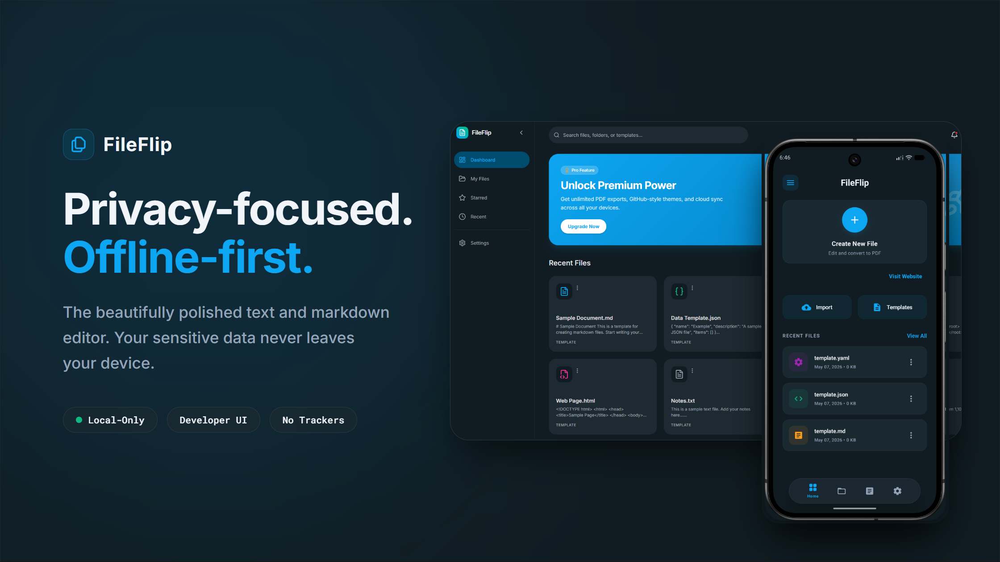
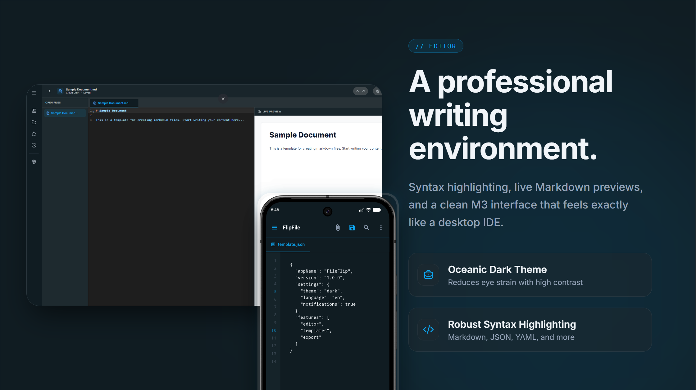
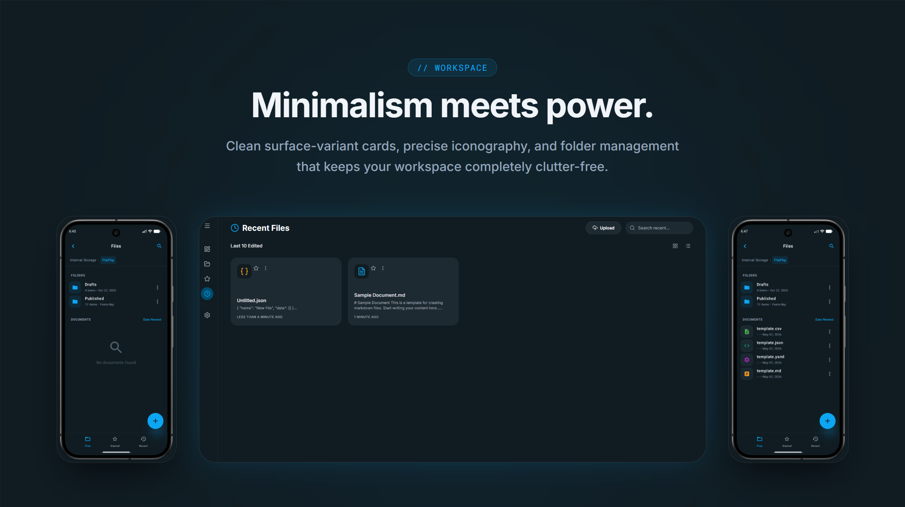
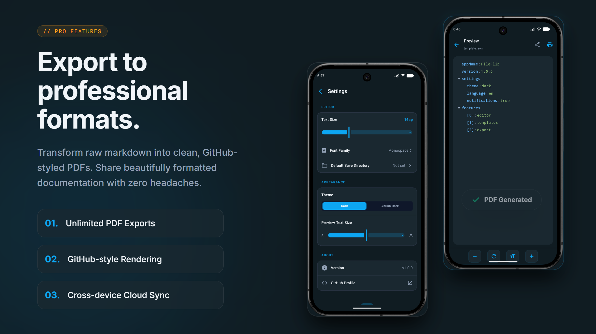

# FileFlip

FileFlip is an offline-first Android app for editing, previewing and exporting text-based files. It provides a polished editor with syntax highlighting for Markdown, JSON, CSV, XML and other formats, an in-app preview powered by WebView, and professional GitHub-styled PDF export.

## 🚀 Product Showcase

  

  

  

  

> **Download the app**: Get the latest APK from the [Releases](https://github.com/krit-vardhan-mishra/File-Flip/releases) section.

> **Live web app**: [https://file-flip-fawn.vercel.app/](https://file-flip-fawn.vercel.app/)

**Short description**
- **One-liner**: FileFlip — Offline Android editor & converter for Markdown, JSON, CSV and more with live preview and styled PDF export.

**Key features**
- **Offline first**: All editing, previewing and export happens locally — no internet required.
- **AI Agent Integration**: Selection-aware text editing, explanations, formatting, and translation powered by LLMs.
- **Keystore Credential Encryption**: Secure Android KeyStore AES-CBC-PKCS7 encryption for Gemini, Groq, and OpenRouter API credentials in `SharedPreferences`.
- **Multi-Provider Fallback**: Intelligent failover/rate-limit recovery that automatically reroutes LLM payloads to secondary providers.
- **Optimized Chat Memory**: Context-efficient rolling window of the last 10 messages with background summarization for chats exceeding 20 messages.
- **Autonomous Web Search**: Custom zero-dependency tool calling loop that fetches real-world DuckDuckGo search context for time-sensitive queries.
- **Multi-format support**: .md, .json, .yaml, .xml, .txt, .html, .log, .csv (rendered appropriately: HTML/WebView, tables for CSV, tree view for JSON/YAML, etc.).
- **Editor**: Syntax highlighting, line numbers, tabbed file UI, selection-aware formatting tools and cursor-aware insertions.
- **Preview**: Dedicated preview screen accessible from the FAB; live sync with editor for Markdown and other formats.
- **Export**: Professional GitHub-styled PDF export via Android PrintManager / PdfDocument.
- **File management**: Create, open, save, rename, delete files using Android system picker and app storage.
- **Architecture**: MVVM + Clean Architecture, Hilt Room Database, Dagger Hilt DI, Kotlin Coroutines & Flows.

**How it works (functioning & workflow)**
- Open or create a text file from the dashboard or top toolbar.
- Edit content in the main editor which provides syntax highlighting and formatting helpers specialized by file type.
- Tap the FAB (preview) to view the rendered output in the Preview screen. Previews use a WebView for HTML/Markdown and format-specific renderers (CSV table, JSON tree, etc.).
- Export the preview as a styled PDF using the share/export menu or PrintManager. The exported PDF uses a GitHub-like CSS for Markdown rendering to keep output professional and readable.
- All operations (parsing, rendering, export) run locally on the device — no external services required.

**Supported file formats**
- Markdown (.md)
- JSON (.json)
- YAML (.yaml / .yml)
- XML (.xml)
- HTML (.html)
- CSV (.csv)
- Plain text (.txt, .log)
